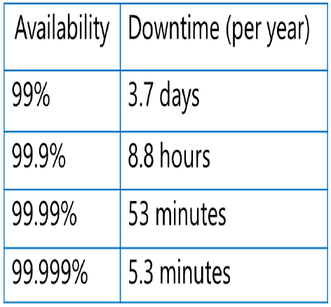

# 1교시-3교시

### 시험 리뷰:hibiscus: 

:hibiscus: **클라우드컴퓨팅이란?**

: 신축성과 확장성이 있고 네트워크(웹 브라우져)를 통해서 제공되는 서비스  

:hibiscus: **클라우드의 종류**

: 공공 클라우드, 사설 클라우드, 하이브리드 클라우드

> Public Cloud : IT 벤더에서 제공하는 것 (AWS, Azure .. )
>
> Private Cloud : On-Premise(회사 네트워크)에서 쓰는 것
>
> ​		MS의 Hiper-V, VMWare의 Vsphere
>
> Hybrid Cloud : 공공과 사설을 오가며 사용

:hibiscus: **클라우드의 특징**

: On - demand 

네트워크를 통해 사용

리소스(서버, 스토리지, 네트워크 .. )가 가상화 돼 풀링

On - premise 환경보다 비용이 적다. 

**:hibiscus: 클라우드 서비스 모델**

IaaS : 서버, 스토리지, 네트워크를 제공하는 모델

​		(SQL이 깔려있는 VM)

PaaS : 개발만 하면 되는 환경을 제공하는 모델

​		(Azure DB, Wep App)

SaaS : S/W자체를 제공하는 서비스

**:hibiscus: SLA **

availability zone => 99.99  => 데이터센터 복제

availability sets   => 99.95  => 렉 단위 복제

:hibiscus: Virtual Network

:hibiscus: VPN 

:hibiscus: Azure vNet 최대 Subnet

29비트 (Host는 3대//-네트워크1 -브로드캐스트1 -예약3) 

:hibiscus: **터널링**

​	PPTP (사용X)

---

​	L2TP : IPSec과 연동 (패킷 암호화)

​	SSTP : TCP 443포트로 접근 (SSL)

---

​	IKEv2 : 세션이 끊겨도 서버에서 자동으로 접속

​				(클라이언트는 끊김 체감 X / 재인증 X)

:hibiscus: **Ping**

 : 응답을 받기 위해서는 `ICMP 프로토콜`을 열어야함

:hibiscus: **net use**

: 공유폴더 접근 / Azure File Storage접근

:hibiscus: **wf.msc​**  

: 고급 방화벽 설정 열기

:hibiscus: **netstat -na**

:  어떤 컴퓨터와 연결 돼있는지, 어떤 포트가 열려있는지

:hibiscus: **ipconfig /dispalydns**

: dns 캐쉬 보기

:hibiscus: **ipconfig /flushdns**

: dns 캐쉬 날리기

:hibiscus:  TCP 

 80 - Web Server HTTP

1633 - SQL

21 - FTP

22 - SSH

23 - telnet

:hibiscus: **MFA** 다중인증

:hibiscus: **Cloud Shell**

설치 없이 Power Shell과 CLI를 사용할 수 있음

:hibiscus: **Power Shell에 Az 모듈 설치**

1. power shell에 Az모듈 설치
2. connect-AzAccount	#Azure계정과 연결
3. Get-AzSubscription
4. Select-AzSubscription

:hibiscus: **Azure CLI**

1. CLI 설치
2. az login
3. az account list	# Subscription 출력
4. az account set	# Subscription 선택

:hibiscus: **NAT (Network Address Translation)**

: 사설 IP가 인터넷 망을 쓰기위해서 주소를 공인 IP로 변환하는 것

:hibiscus: **Load balancer (L4)**

: 부하를 분산처리해주는 것

: 다른 region에 있는 것은 분산처리 불가 => L7

> **Probe** : Backend pool의 건강상태 체크

:hibiscus: **Authentication** (인증)

: `credential`을 확인하는 것

**:hibiscus: Authorization** (허가)

: 인증한 사용자에 대해서 권한이 주어지는 것

**:hibiscus: Credential** 

: `IDentity` + `password`

**:hibiscus: Token**  

: 인증된 사용자의 정보가 저장되는 곳

:hibiscus: **SID**

: 고유번호